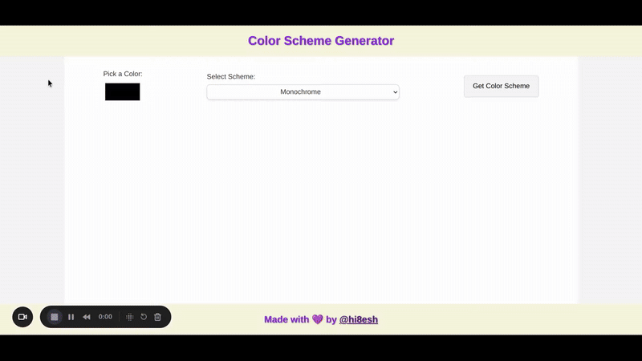

# 🎨 Color Scheme Generator

A web app that lets you pick a color and instantly generate beautiful color schemes using [The Color API](https://www.thecolorapi.com/).



## 🌟 Features

- 🎨 Pick a base color using the color input
- 🔁 Choose from multiple scheme modes (Monochrome, Complement, Analogic, etc.)
- 📋 Click on a color or hex code to copy it to the clipboard
- 💡 Hover to preview RGB and HSL values via tooltip
- 📱 Fully responsive design for mobile and tablet screens


## 🧪 Live Demo

Check it out here 👉 [Live Demo](https://your-live-url.com)

## 🚀 How to Use

1. Clone this repo:
   ```bash
   git clone https://github.com/yourusername/color-scheme-generator.git
   cd color-scheme-generator
   ```
2. Open `index.html` in your browser.

## 🛠️ Tech Stack

- **HTML5**  
- **CSS3** (Responsive, Flexbox, CSS variables)  
- **JavaScript (Vanilla)**  
- [**TheColorAPI**](https://www.thecolorapi.com/) for color data

## 🙌 Acknowledgments

- Thanks to [TheColorAPI](https://www.thecolorapi.com/) for providing the color data used in this project.

---

## 📄 License

This project is licensed under the [MIT License](LICENSE).

---

## 💜 Made with love by [@hi8esh](https://github.com/hi8esh)
